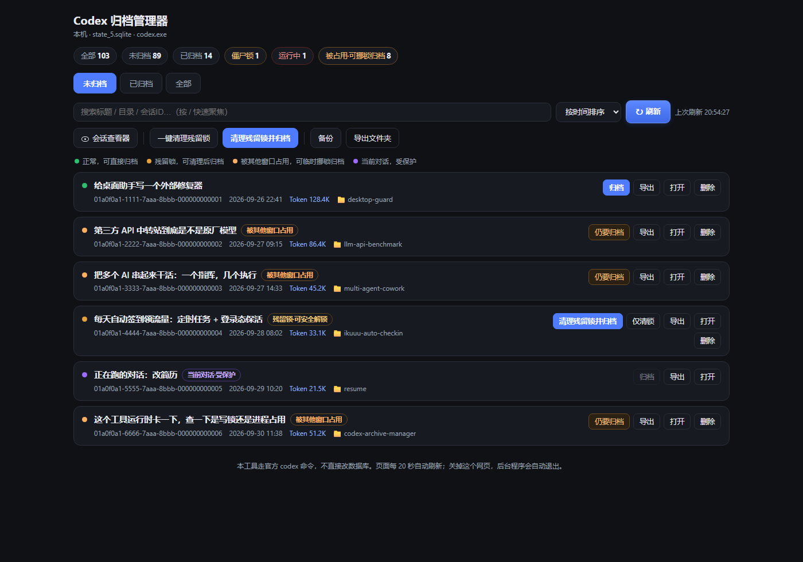
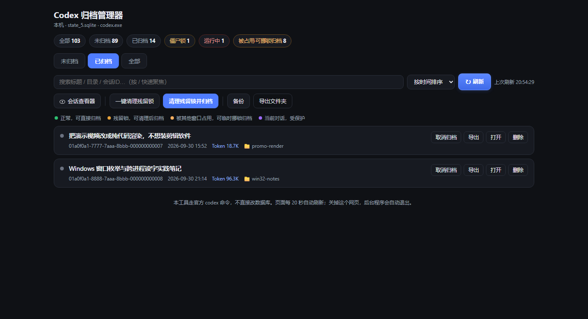

# Codex Archive Manager

A local web UI that reliably archives / unarchives / deletes Codex Desktop sessions —
including the ones the sidebar refuses to archive because of the thread-writer lock
(`os error 32`, `failed to open thread writer lock`, `already has an active writer`).

> **Status:** Windows 11 + Codex Desktop `26.924.x` tested end-to-end on real sessions.
> Pure Python standard library, no third-party packages, binds to `127.0.0.1` only.

## 界面预览

主界面（未归档）：



已归档视图 —— 归档后可随时取消归档：



> 截图里的会话名是演示数据（真实界面 + 假数据），不是任何人的真实会话。

## The problem

On recent Codex Desktop builds, clicking "Archive chat" in the sidebar can fail even
though nothing is wrong with your session data:

- The desktop app keeps an OS-level **writer lock** on every session it has ever loaded:
  `%USERPROFILE%\.codex\thread-writer-locks\<thread-id>.lock`
- Archiving needs that same lock, so it ends up blocking itself.
  The UI just says *"Failed to archive conversation"* / *无法归档对话*.
- Restarting the app doesn't help, and neither does re-logging in.
  It has nothing to do with your network, your account, or a custom model provider.

See the upstream reports: [#49116](https://github.com/openai/codex/issues/49116),
[#48367](https://github.com/openai/codex/issues/48367),
[#48961](https://github.com/openai/codex/issues/48961),
[#46433](https://github.com/openai/codex/issues/46433).

## The fix

The lock file is opened with `FILE_SHARE_DELETE`, which means **you can rename it out
of the way while the app still holds it**. Once the canonical
`<thread-id>.lock` name is gone, the official `codex archive` command succeeds
immediately. The old handle the app keeps is harmless — it just points at the renamed
file, and your session data is never touched.

This tool does exactly that, and nothing more:

1. rename `<thread-id>.lock` → `<thread-id>.lock.parked-<timestamp>` (backed up first)
2. run the **official** `codex archive <thread-id>` / `codex unarchive` / `codex delete`
3. remove the parked lock (so unarchiving won't hit the same wall later)

It never edits the SQLite database by itself — every state change goes through the
official CLI, so the desktop app stays consistent.

## Features

- Web UI: browse **Active / Archived / All**, search titles and message bodies
- Archive · Unarchive · Delete · Export to Markdown · Open in a new terminal
- Lock status per session (free / held / zombie / busy) with one-click "park & archive"
- Delete always keeps a snapshot under `backup\deleted\`
- Closes itself: shut the browser tab and the background process exits ~10s later
- Bonus `lock_guard.py`: a background watchdog that clears zombie locks every 15s.
  It only touches sessions that are provably finished and idle — running chats are
  never touched.

## Requirements

- Windows 10/11 (macOS/Linux: the Python core should work, but it is **untested**)
- Python 3.8+
- Codex Desktop installed (`codex.exe` is located automatically)

## Quick start

```bat
:: 1. double-click (no console window)
启动归档管理器.bat

:: or run it manually
python codex_archive_manager_gui.py
```

Your browser opens `http://127.0.0.1:8765/` (auto-falls back to 8766, 8767… if busy).
Close the tab when you're done — the backend exits by itself.

Optional background watchdog:

```bat
启动归档解锁守护.bat   :: start, every 15s
停止归档解锁守护.bat   :: stop
```

Command line:

```bat
python codex_archive_manager_gui.py --check   :: self-test, prints session counts
python codex_archive_manager_gui.py --port 9000
python codex_archive_manager_gui.py --no-watchdog   :: keep running with no browser open
```

## Protect a session from automation

By default no session is protected. To make sure the tools never touch the chats you
are actively using, list their IDs:

```bat
set CODEX_ARCHIVE_PROTECTED=<thread-id-1>,<thread-id-2>
```

Protected sessions show a purple dot and are excluded from every automatic action.

## Optional: read-only session viewer button

The UI has a "Session viewer" button that can launch a third-party read-only viewer.
Point it at the executable (or leave it unset — the button then just shows a hint):

```bat
set SESSIONS_VIEWER_PATH=E:\SessionsViewer\Sessions Viewer.exe
```

## Safety notes

- Everything stays local: `127.0.0.1` only, no network calls, no telemetry.
- `.coordination.lock` is never touched. Busy sessions are never parked automatically.
- Every park operation is backed up under `backup\locks\` before it happens.
- After a successful archive, **do not put the lock file back by hand** — that would
  make unarchiving hit the same wall again.

## FAQ（常见问题）

| Symptom / 现象 | What to do / 怎么办 |
| --- | --- |
| Archive still fails from the sidebar<br>从侧边栏点「归档对话」还是失败 | Use this web UI, or park the lock from it first<br>改用本工具网页，先在网页里挑锁再归档 |
| `os error 32` / `failed to open thread writer lock`<br>报 `os error 32` / `failed to open thread writer lock` | Expected — that's the bug this tool works around<br>属于预期内，正是本工具要绕开的那个 bug |
| Web page won't open<br>网页打不开 | Port busy? It auto-switches; check `logs\manager_gui.log`<br>端口被占？会自动换端口；可看 `logs\manager_gui.log` |
| I want to undo an archive<br>想取消归档 | Open the "Archived" tab → Unarchive<br>打开「已归档」页→ 取消归档 |
| Page flickers once in a while<br>页面偶尔闪一下 | Normal — it re-renders every 20s only when data actually changed<br>正常：只有数据真变了才会每 20 秒重刷一次 |
| What is a "zombie" lock?<br>什么叫「僵尸锁」？ | The chat has definitely finished and no process holds the lock - it is leftover. "Clean zombie locks" clears these safely<br>会话已确定跑完、没任何进程占着这把锁，是残留下来的。点「一键清理残留锁」就能安全清掉 |
| Why is a session "busy" and not unlockable?<br>为什么会话显示「运行中」且不能解锁？ | Its last recorded event is `task_started`, so it may still be running. Wait ~2 min and refresh; the button turns into "Force archive" once it settles<br>它最后一条记录是 `task_started`，可能还在跑。等约 2 分钟再刷新，安静后按钮会变成「强制归档」 |
| A chat shows "held by another window"<br>会话显示「被其他窗口占用」 | A Codex window still holds its writer lock. Click "Archive anyway" - the tool parks the lock, archives, then puts it back. It does not close your window<br>某个 Codex 窗口还拿着写锁。点「仍要归档」，工具会先备份再把锁暂时挪走，归档完再放回去，不会关你的窗口 |
| Can it touch a chat I am using right now?<br>它会动我正在用的对话吗？ | Not if you list its ID in `CODEX_ARCHIVE_PROTECTED`; protected chats show a purple dot and are skipped by every automatic action<br>把会话 ID 加进 `CODEX_ARCHIVE_PROTECTED` 就不会；受保护的会话显示紫点，所有自动动作都会跳过它 |
| Where do exports and deleted-session snapshots go?<br>导出文件和删除快照在哪？ | `exports\` and `backup\deleted\` next to the script; the "Open folder" buttons jump straight there<br>就在脚本旁边的 `exports\` 和 `backup\deleted\`；点界面上的「导出文件夹」直接跳过去 |
| Does it ever touch `.coordination.lock`?<br>它会动 `.coordination.lock` 吗？ | Never. Only per-session `<thread-id>.lock` files are parked, and only after a backup under `backup\locks\`<br>绝不会。只会挪每个会话自己的 `<thread-id>.lock`，而且先备份到 `backup\locks\` 才动 |
| The window opened on 8766, not 8765<br>窗口开在 8766 而不是 8765 | The port was busy, so it auto-shifted. Use `--port 9000` if you want a fixed one<br>端口被占会自动往后移。想固定端口就用 `--port 9000` |

## Files

```
codex_archive_manager_gui.py   web UI + archive engine (stdlib only)
lock_guard.py                  optional background lock watchdog
webui/index.html               the UI (no build step)
启动归档管理器.bat / 启动归档解锁守护.bat / 停止归档解锁守护.bat
```

## Disclaimer

This is a workaround for an upstream bug, not an official OpenAI tool. It renames
lock files, which is an undocumented behaviour of the current builds — it has been
verified on Windows 11 with Codex Desktop 26.924.x, but a future release may change
that. Use at your own risk; everything it deletes is snapshotted first.

---

## 中文说明

**Codex 归档管理器**：一个本机网页工具，用来可靠地归档 / 取消归档 / 删除 Codex 桌面端会话。

**为什么需要它**：最近版本的 Codex 桌面端会给每个打开过的会话保留一把"写锁"
（`%USERPROFILE%\.codex\thread-writer-locks\<会话ID>.lock`）。归档需要同一把锁，
于是变成"自己挡自己"，界面上只显示"无法归档对话"，与网络、账号、第三方模型服务都无关。

**解决办法**：这把锁是以允许改名的方式打开的，所以**进程还拿着锁也能把文件名挪走**。
挪走后官方 `codex archive` 立刻成功。本工具只做三件事：备份并挪锁 → 调用官方命令 →
清理挪走的锁。它从不自己改数据库，所有状态变更都走官方 CLI。

**使用**：双击 `启动归档管理器.bat`（无黑框），浏览器自动打开；用完关掉网页，
后台约 10 秒后自动退出。可选的后台守护用 `启动归档解锁守护.bat` 启动，
它只处理"确实已经跑完且空闲"的会话，正在运行的对话绝不碰。

**保护名单**：默认不保护任何会话；用环境变量 `CODEX_ARCHIVE_PROTECTED="会话ID1,会话ID2"`
把你正在用的对话加进去，它们将不参与任何自动操作。